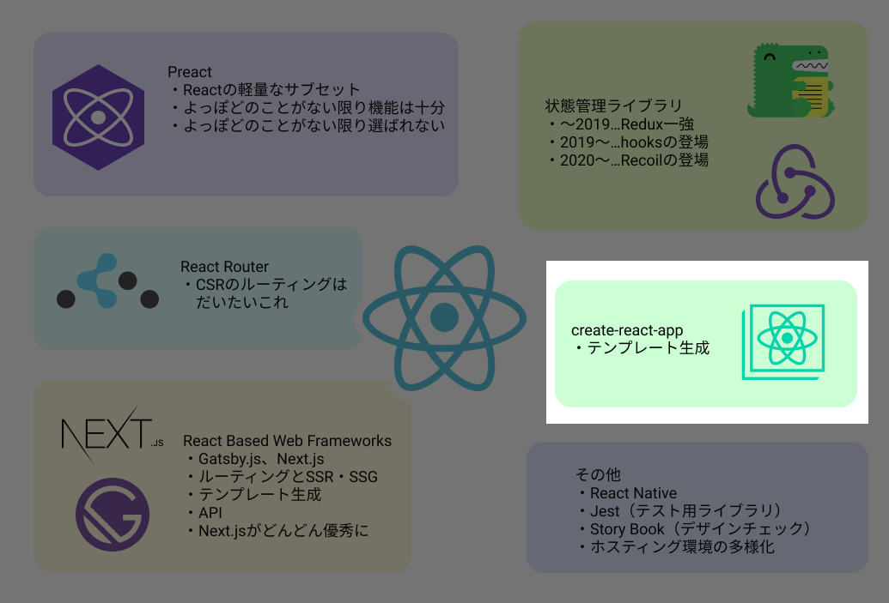

# 2021年新春 Reactが怖くなくなる話


# 目標：Reactが怖くなくなくなる :rocket:

# アジェンダ
## 導入
「Reactってこんなもの」のイメージを共有します。
- Reactってどんなイメージですか？
- 2020年末のReactエコシステム

## やってみよう
create-react-appでテンプレートを生成して観察してみましょう。
- Start with create-react-app ★Hands On
- 各ディレクトリの役割
- コンポーネント志向

## コンポーネントとReact hooks
実装する際にまず知っておく必要がある要素について紹介します。
- 関数コンポーネントとクラスコンポーネント
- 基本のフック - useState(), useEffect(), useContext()　★Hands On
- 追加のフック - useReducer()

## React開発における「React以外」の話
実際にWebアプリケーションを作る際に必要になる
「React以外のもの」の紹介です。
- スタイリング - CSS in JS vs Moduled CSS
- 状態管理 - Context API, Redux, Recoil

## 成果物紹介
- Next.js x firebaseでつくる俳句管理アプリ「季語別俳句帖」

# Reactってどんなイメージですか？

## :thinking:

## アサヅは最初こんな印象を持ちました
- SPAを作れるやつ
- なんか難しそう
- フロントエンドのつらみをいろいろ解消してくれる？
- 部品単位で開発できて効率よさそう
- AndroidのViewとかに相当するものを作っていくイメージかな？


## 遠からず

## 例えばこんな「部品」
```javascript
const MyComponent = () => (
  <p>Hello, World!</p>
)

export default MyComponent
```

## JSの中にHTML…? :thinking:
- 不気味
- これと何が違うんだろう…

```javascript
function createMyComponent() {
  return '<p>Hello, World!</p>'
}
```

## JSX ≠ HTML

## JSXはJSにコンパイルされる

## Babelによるコンパイル結果

```jsx
const MyComponent = () => (
  <p>Hello, World!</p>
)
```

↓

```jsx
import {jsx as _jsx} from 'react/jsx-runtime';

const MyComponent = () => (
  _jsx('p', { children: 'Hello World!' })
)
```
※React 17～
※昔は`React.createElement()`が呼ばれてました
※ここからさらにwebpackで変換かかったりします

## なんだ、JSじゃん。
怖くないですね

## で、こいつはどうやったら表示できるのよ :thinking:

## `ReactDOM.render()`

```html
<html>
  <body>
    <div id="hello-world"></div>
  </body>
</html>
```

```jsx
import ReactDOM from 'react-dom' // おっ、'react'とは別のパッケージだぞ
import MyComponent from './components/MyComponent'

const element = <MyComponent></MyComponent>

ReactDOM.render(element, document.getElementById('hello-world'))
```

## 実行結果
sample1

```html
<html>
  <body>
    <div id="hello-world">
      <p>Hello, world!</p>
    </div>
  </body>
</html>
```
※だいぶ省略しています

## 他にもこんな特徴があります

- 宣言的UI
- DOM構成をJSのオブジェクトで表現
変更差分を検知して一括描画
- 関数型プログラミングとの親和性

# 2020年末のReactエコシステム
---


## いっぱいあってよくわからない :cry:

---



# Start with create-react-app :rocket:
※せっかくなのでTypeScriptも触りましょう　怖くないです
```
$ npm i -g create-react-app
$ create-react-app sample-app --template typescript
```

# 各ディレクトリの役割
<!-- TBD -->

# コンポーネント志向

## コンポーネントとは
- 「部品」、「構成要素」
- 構造、見た目、振る舞いを1つのセットとして捉える
→ HTML, CSS, JavaScript

## （フロントエンドにおける）<br>コンポーネント志向とは
- コンポーネントをいっぱいつくって
ページを構築しよう！という考え方

## コンポーネント志向のメリット
1コンポーネント1ファイルなので…
- 読みやすい
- テストしやすい
- 変更に強い
- 再利用性が高い

### 複雑なアプリケーションを作るには必須:bangbang:

# コンポーネントとReact hooks

## コンポーネント

クラスコンポーネント
```js
class Welcome extends React.Component {
  render() {
    return <h1>Hello, {this.props.name}</h1>;
  }
}
```

関数コンポーネント
```js
function Welcome(props) {
  return <h1>Hello, {props.name}</h1>;
}
```

## 2020年末、どちらを選択するか？
- 記述的にシンプルな関数コンポーネントが第一候補
- クラスコンポーネントの優位性であった`state`、
`Lifecycle`はhooksの登場で関数コンポーネントでもほぼ実現可能に

### 基本的に関数コンポーネントでよさそう

# 関数コンポーネントの表現力を<br>高めてくれた「hooks」とはなにか

## hooks導入の経緯

> 典型的な React アプリを React DevTools で見てみると、おそらくプロバイダやらコンシューマやら高階コンポーネントやらレンダープロップやら、その他諸々の抽象化が多層に積み重なった『ラッパー地獄』を見ることになるでしょう。

> フックを使えば、ステートを持ったロジックをコンポーネントから抽出して、単独でテストしたり、また再利用したりすることができます。**フックを使えば、ステートを持ったロジックを、コンポーネントの階層構造を変えることなしに再利用できるのです。**