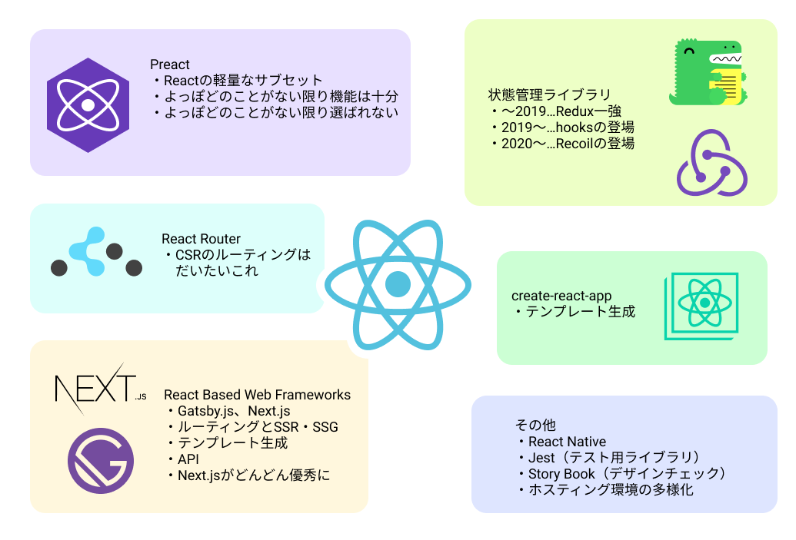

# 2021年新春 Reactが怖くなくなる話


# 目標：Reactが怖くなくなくなる :rocket:

- 社内での再利用性を考慮して初心者向けに寄せた資料です。

- すでに実務でReactを使われている方には物足りないかもしれませんが、
なるべく2020年末の最新状況に合わせた記述を意識しましたので、
情報収集の入り口にしていただければ幸いです。


# アジェンダ
## 導入
「Reactってこんなもの」のイメージを共有します。
- Reactってどんなイメージですか？
- 2020年末のReactエコシステム

## やってみよう
create-react-appでテンプレートを生成して観察してみましょう。
- Start with create-react-app ★Hands On
- 各ディレクトリの役割
- コンポーネント志向

## コンポーネントとReact hooks
実装する際にまず知っておく必要がある要素について紹介します。
- 関数コンポーネントとクラスコンポーネント
- 基本のフック - useState(), useEffect(), useContext()　★Hands On
<!-- - 追加のフック - useReducer() // T.B.D. -->

## React開発における「React以外」の話
実際にWebアプリケーションを作る際に必要になる
「React以外のもの」の紹介です。
- スタイリング - CSS in JS vs CSS Module
<!-- - 状態管理 - Context API, Redux, Recoil // T.B.D. -->

## おまけ：成果物紹介
- Next.js x firebaseでつくる俳句管理アプリ「季語別俳句帖」※未完成

# Reactってどんなイメージですか？

## :thinking:

## アサヅは最初こんな印象を持ちました
- SPAを作れるやつ
- なんか難しそう
- フロントエンドのつらみをいろいろ解消してくれる？
- 部品単位で開発できて効率よさそう
- AndroidのViewとかに相当するものを作っていくイメージかな？


## 遠からず

## 例えばこんな「部品」
```javascript
const MyComponent = () => (
  <p>Hello, World!</p>
)

export default MyComponent
```

## JSの中にHTML…? :thinking:
- 不気味
- これと何が違うんだろう…

```javascript
function createMyComponent() {
  return '<p>Hello, World!</p>'
}
```
### Reactの怖さ（Vanilla JSとの大きな違い）= JSX

## JSX ≠ HTML
- 文字列ではありません
- HTMLそのものでもありません
- JSXはJSにコンパイルされます

## ex. Babelによるコンパイル結果

```jsx
const MyComponent = () => (
  <p>Hello, World!</p>
)
```

↓

```jsx
import {jsx as _jsx} from 'react/jsx-runtime';

const MyComponent = () => (
  _jsx('p', { children: 'Hello World!' })
)
```
※React 17～
FYI: https://ja.reactjs.org/blog/2020/09/22/introducing-the-new-jsx-transform.html
※16以前は`React.createElement()`が呼ばれてました

## なんだ、ただのJavaScriptじゃん。
怖くないですね

## ちなみに
JSXそのものは、Reactとは全く別の仕様として存在しています。
FYI: https://facebook.github.io/jsx/

専用のbable plugin等を利用すれば
Vue.js等でもJSXを利用することができます。

## で、こいつはどうやったら表示できるのよ :thinking:
こいつ↓
```jsx
const MyComponent = () => (
  <p>Hello, World!</p>
)
```


## `ReactDOM.render()`の引数に渡す

```html
<html>
  <body>
    <div id="hello-world"></div>
  </body>
</html>
```

```jsx
import ReactDOM from 'react-dom'
import MyComponent from './components/MyComponent'

const element = <MyComponent></MyComponent>

ReactDOM.render(element, document.getElementById('hello-world'))
```

※`react-dom`は`react`コアとは切り離されたパッケージとして提供されている
→React Native等への応用が可能となっている
## 実行結果
```html
<html>
  <body>
    <div id="hello-world">
      <p>Hello, world!</p>
    </div>
  </body>
</html>
```
※だいぶ省略しています

## Reactには他にもこんな特徴があります

- 宣言的UI
「あるべき姿」を宣言し表現する（対：命令的）

- 仮想DOM
DOM構成をJSのオブジェクトで表現し、
仮想DOMツリーの変更差分をレンダリングする

- 関数型プログラミングとの親和性
`UI=f(state)`という考え方

詳しくはggってください、、、

# 2020年末のReactエコシステム
---


## いっぱいあってよくわからない :cry:
というか書ききれていないです　まだある　無限にある

---


# Start with create-react-app :rocket:
※せっかくなのでTypeScriptも触りましょう
Android経験者なら強力な型補完に良さを感じると思います
```
$ npm i -g create-react-app
$ create-react-app sample-app --template typescript
```

# 各ディレクトリの役割
実際にモノを見ながら説明します

# 「コンポーネント志向」という考え方

## コンポーネントとは
- 「部品」、「構成要素」
- 構造、見た目、振る舞いを1つのセットとして捉える
→ HTML, CSS, JavaScript

## （フロントエンドにおける）<br>コンポーネント志向とは
- コンポーネントをいっぱいつくって
ページを構築しよう！という考え方

## コンポーネント志向のメリット（私見）
- 1コンポーネント1ファイルなので読みやすい
- テストしやすい
- 変更に強い
- 再利用性が高い
- ローカルな状態管理がしやすい
- OOPの基本知識が設計に活かしやすい

## コンポーネント志向の課題（私見）

- コンポーネント内でのUIとロジックの密結合
→ロジックの使いまわしが難しい

- 多くのコンポーネント志向ライブラリはView層にしか関心を持たず、
「それ以外」は実装者にゆだねられがち
　・　ビジネスロジックをどう実装するか
　・　コンポーネント間の状態管理をどうするか

<br>
→ 多くのコンポーネント志向SPAライブラリは、<br>
これらの課題を個別に解消するエコシステムを持っている

---


# コンポーネントとReact hooks

## コンポーネント

クラスコンポーネント
```js
class Welcome extends React.Component {
  render() {
    return <h1>Hello, {this.props.name}</h1>;
  }
}
```

関数コンポーネント
```js
const Welcome: React.VFC<Props> = (props) => {
  return <h1>Hello, {props.name}</h1>;
}
```

※`React.VFC`＝`VoidFunctionalComponent`
（関数コンポーネントの型の一種 `@types/react 18^`）
## 2020年末、どちらを選択するか？
- 記述的にシンプルな関数コンポーネントが第一候補
- クラスコンポーネントの優位性であった`state`、
`Lifecycle`はhooksの登場で関数コンポーネントでもほぼ実現可能に

### 基本的に関数コンポーネントでよさそう

# 関数コンポーネントの表現力を<br>高めてくれた「hooks」とは？

## hooks導入の経緯

> 典型的な React アプリを React DevTools で見てみると、おそらくプロバイダやらコンシューマやら高階コンポーネントやらレンダープロップやら、その他諸々の抽象化が多層に積み重なった『ラッパー地獄』を見ることになるでしょう。

> フックを使えば、ステートを持ったロジックをコンポーネントから抽出して、単独でテストしたり、また再利用したりすることができます。**フックを使えば、ステートを持ったロジックを、コンポーネントの階層構造を変えることなしに再利用できるのです。**

https://ja.reactjs.org/docs/hooks-intro.html#motivation

## ルール
- 呼び出しは関数コンポーネントのトップレベル
or カスタムhooksのトップレベルのみ

- カスタムhooksを自作する場合、命名規則`useXXX`遵守

## useState
```js
const [state, setState] = useState(initialState)
```

- ステートフルな値とそれを更新するための関数を返却する

## ボタンを押してカウントアップするコンポーネント
```js
import { useState, useEffect } from 'react'

const Counter:React.VFC = () => {
  const [count, setCount] = useState(0)

  return (
    <>
      <div>{count}回クリックされました！</div>
      <button onClick={() => setNumber(count + 1)}>ボタン</button>
    </>
  )
}
```
- ボタンを押される
→stateが更新される
→stateの変更にもとづいて再レンダリングされる

---

※`<></>`=`<React.Fragment>`
「レンダリングされない括る専用要素」と思っておけばひとまずOK

## useEffect
```js 
useEffect(functionWhenUpdated)
```

- 副作用（再レンダリング等）を契機に実行する処理
- 第二引数を用いて実行タイミングを制御可能（説明略）

## ボタンを押してカウントアップするコンポーネント②

```js
import { useState, useEffect } from 'react'

const Counter():React.VFC = () => {
  const [count, setCount] = useState(0)
  useEffect(() => {
    document.title = `${count}回クリックされたページ`;
  })

  return (
    <>
      <div>{count}回クリックされました！</div>
      <button onClick={() => setCount(count + 1)}>ボタン</button>
    </>
  )
}
```
再レンダリング（副作用）を契機に、ページのタイトルが変更される

---

- ※ 副作用がある関数
≒ 純粋でない関数
≒ 同じ引数を渡しても同じ結果が返ってくるとは限らない関数

- レンダリングが発生した
＝ 結果が前回と異なる
＝ 副作用が生じている
→ 副作用フックが実行される

## useContext

```js
const contextValue = useContext(contextKey)
```
Context API（後述）から値を取得

## Contextの値をもとに表示色を設定するボタン
```js
import {useContext} from 'react'
import ThemeContext from '../contexts/theme-context' // context定義ファイル

const ThemedButton():React.VFC = () => {
  const theme = useContext(ThemeContext)
  return (
    <button style={{ background: theme.background, color: theme.foreground }}>
      テーマカラーで配色されたボタンです！
    </button>
  )
}
```

## ContextAPIによる`Theme`の提供
- React.createContext()
- Context.Providerコンポーネント

```js
const themes = {
  light: {
    foreground: "#000000",
    background: "#eeeeee"
  },
  dark: {
    foreground: "#ffffff",
    background: "#222222"
  }
}

const ThemeContext = React.createContext(themes.light) // 初期値

export default ThemeContext
```

--- 

```js
import ThemeContext from './contexts/ThemeContext'
import ThemeButton from './components/ThemeButton'

const App: React.VFC = () => {
  return (
    <ThemeContext.Provider value={themes.dark}>
      <ThemeButton />
    </ThemeContext.Provider>
  )
}
```

- `<ThemeContext.Provider>`の子孫要素として表現されたコンポーネントは、
`value`に設定された値をContext APIを通じて参照できる

- `value`の値が変更されると再レンダリングされる

## きみだけのhooksを作ろうのコーナー

- 例えば、boolean値をtoggleさせることができる`useBool`

```js
import {useState} from 'react'

const useBool = () => {
  const [bool, setBool] = useState(false)
  const toggleBool = setBoolean(!bool)

  return [bool, toggleBool]
}

export default useBool
```
ちょっとだけ使い勝手がよくなる・安全になる薄いhooksも全然OKだと思います

# React開発におけるReact以外の話
※状態管理の話も入れたかったんですが、今回は未完です。。すみません

## スタイリング
2020年末現在、有力な選択肢は大きく分けて2つ

- CSS in JS
- CSS Modules

どちらも「モノリシックなCSSからコンポーネントごとのCSSへ」の動き

## CSS in JS
### 代表的なライブラリ： styled-components

```js
import {styled} from 'styled-components'

type Props = {
  text: string
}

const Component: React.VFC<Props> = (props) => {
  return <button>{props.string}</button>
}

const StyledButton = styled(Component)`
  > button {
    background-color: black;
  }
`

export default StyledButton
```

## CSS Module

button.module.css

```css
.button {
  background-color: black;
}
```

```js
import Styles from './button.module.css'

type Props = {
  text: string
}

const Component: React.VFC<Props> = (props) => {
  return <button className={Styles.button}>{props.string}</button>
}

export default Component
```

## 両者の比較（どちらも有力。。）
### CSS in JS
- JSの変数が使えるので状態に応じた表現力が高い
- ロジックと層を分ければ保守性アップが見込める

### CSS Modules
- JSとCSSファイルを分けることができるので分業しやすい（かも）
- クラス名にスタイリングを一任できるので見通しが良い

## スタイリングの基本指針
- コンポーネント単位でスタイリングしよう
- ロジックと切り離そう
- コンポーネントは外部からのレイアウトを（なるべく）意識しない
スタイリングにするよう心がけよう
(使われる側が使う側を知るのは良くない、関心の分離)
- 色定義などグローバルに使いまわせる定数は別ファイルに切り分けよう

# まとめ

- Reactの怖さはJSXに拠るところが大きいけど、
仕組みを理解するとただのJSだと分かります。ｺﾜｸﾅｲﾖ

- Reactはエコシステムが肥大化しているので把握が難しいけど、
それって実は「React以外」をどうにかするための試行錯誤でしかない。ｺﾜｸﾅｲﾖ

- React基礎知識をある程度身に付けた後は、
結局、設計パターンをどうするかが問題になると思います。
一般的な開発と大差ありませんし、OOPわかれば普通に戦えます。


# おまけ：成果物紹介
https://kigo-betsu-haiku-cho.vercel.app/
https://zenn.dev/asazutaiga/articles/2046b0fbb1e934